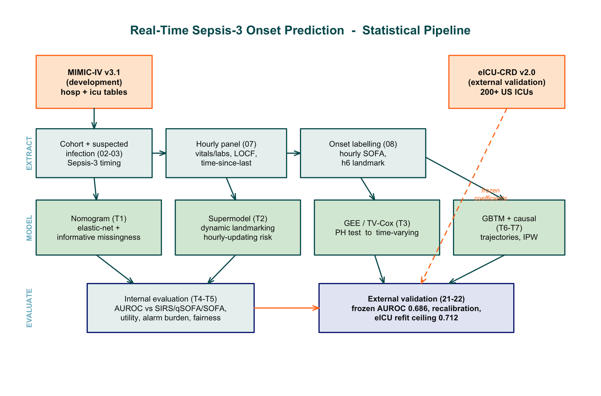
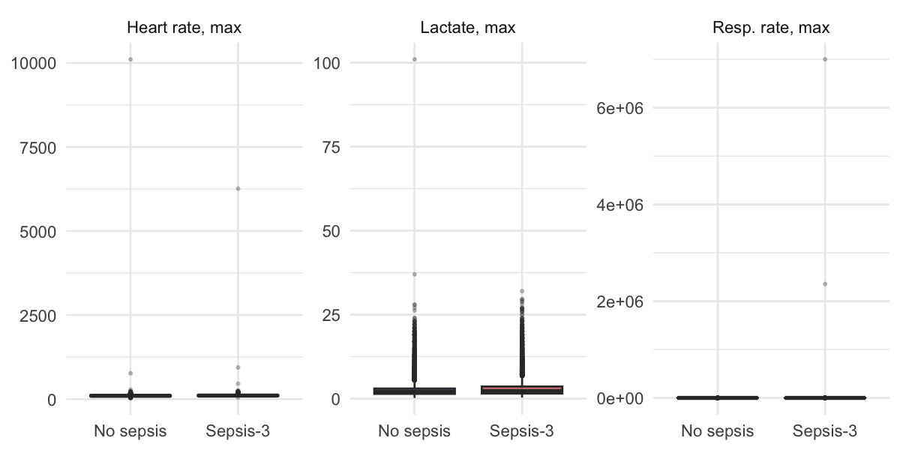
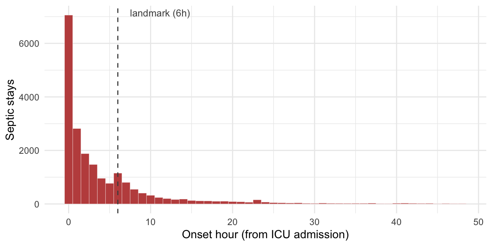
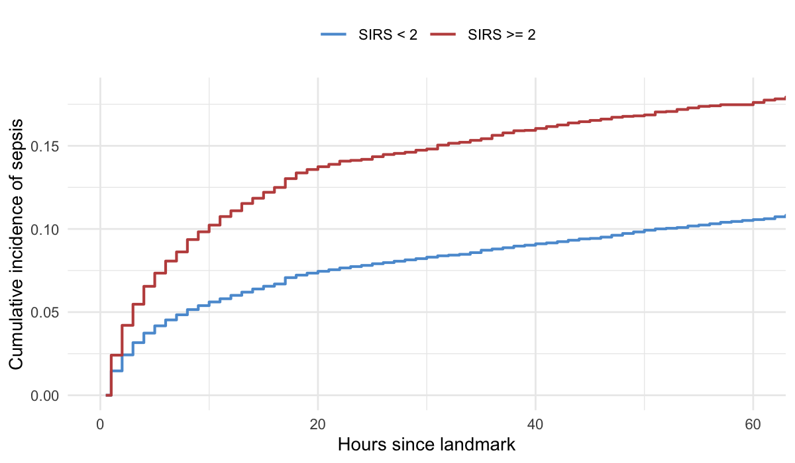
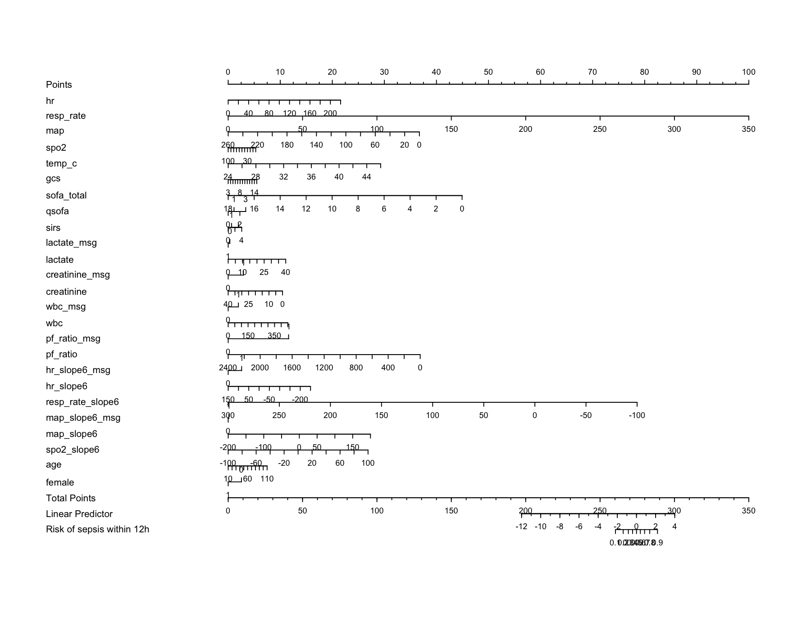
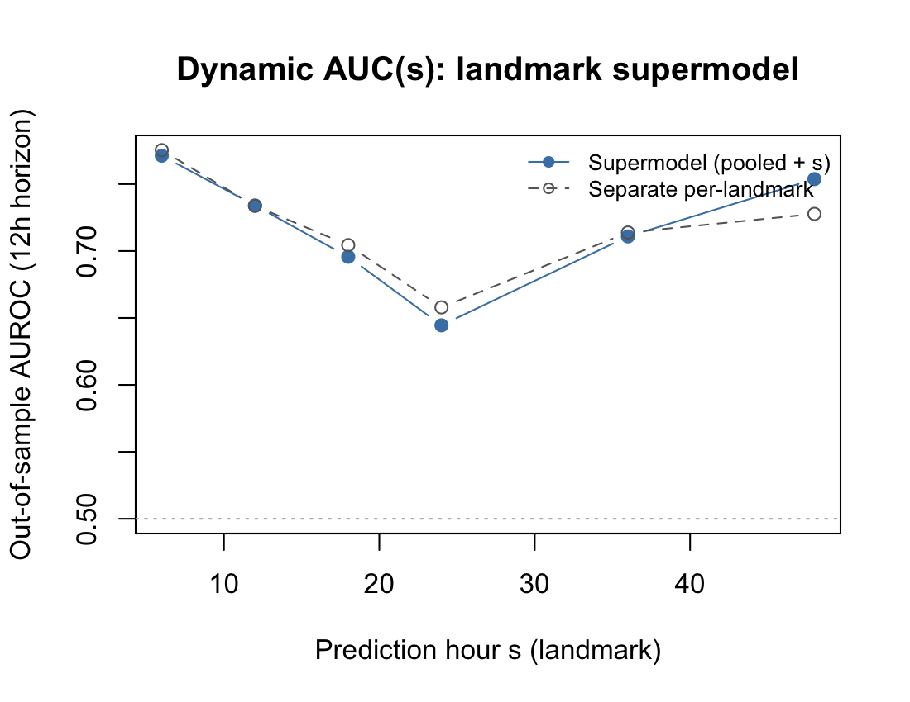
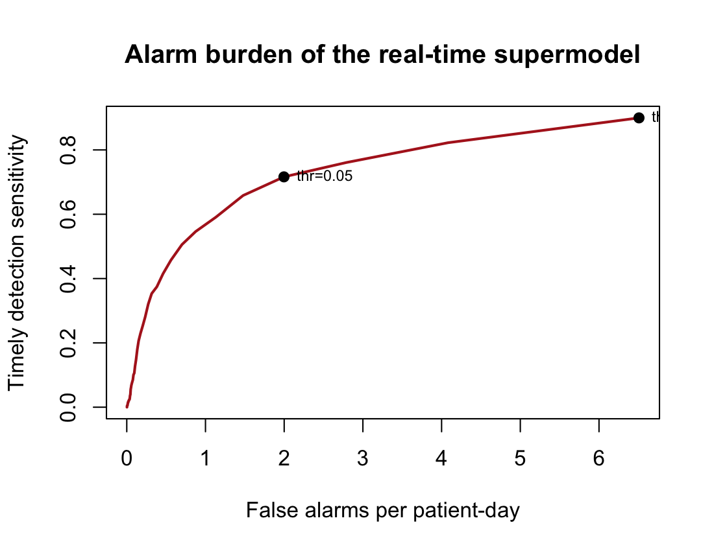
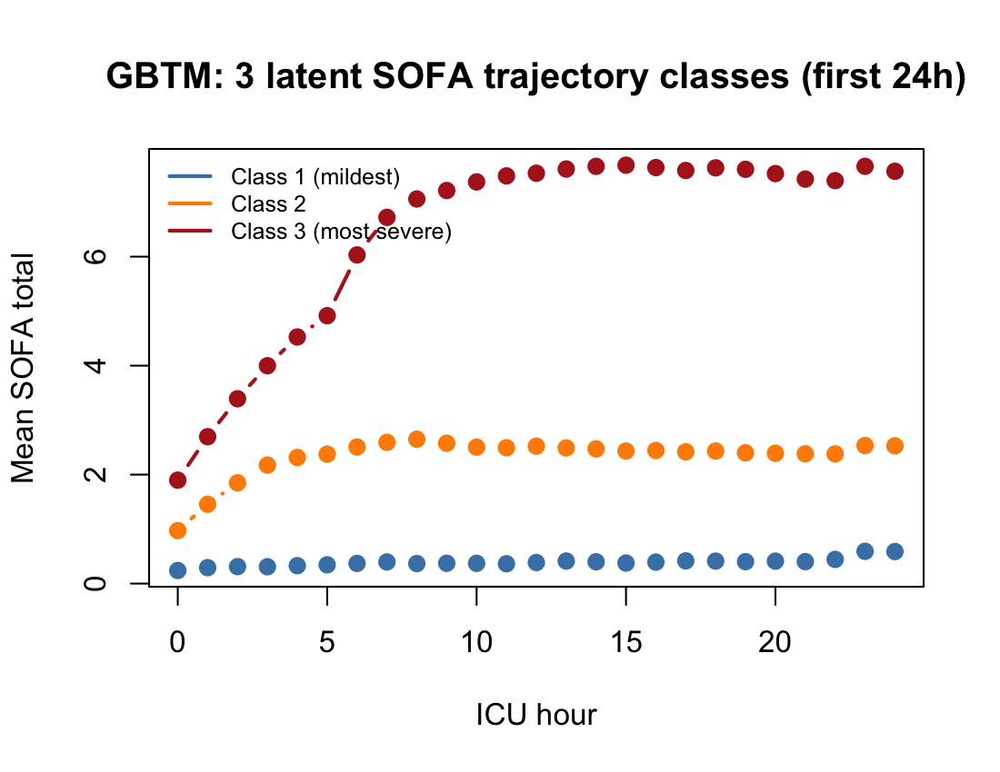
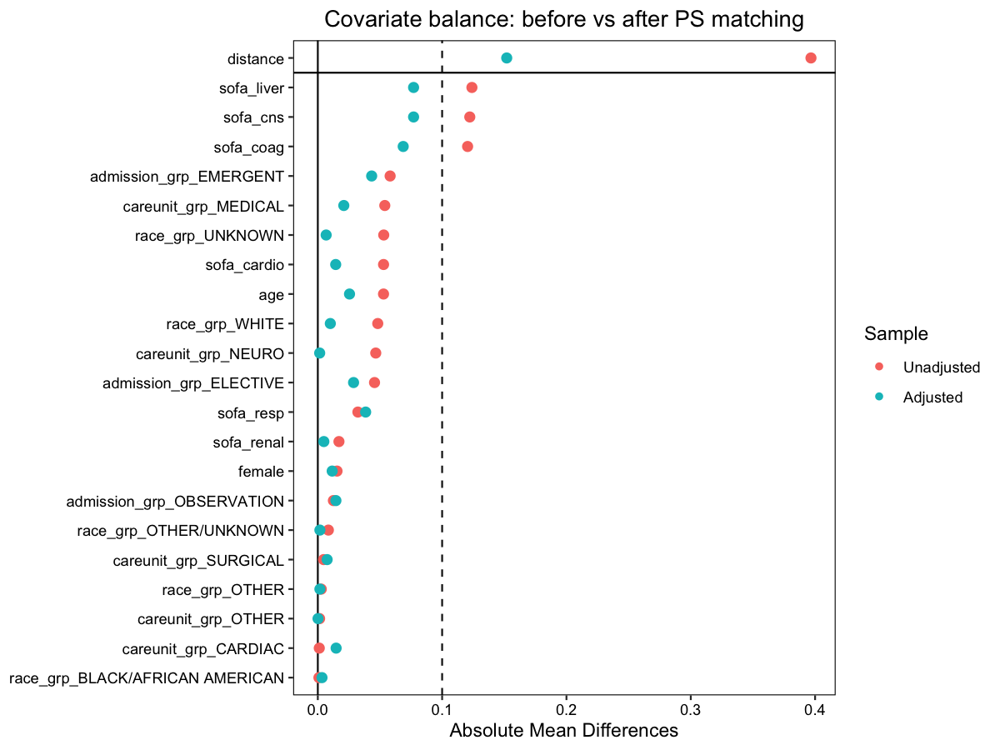
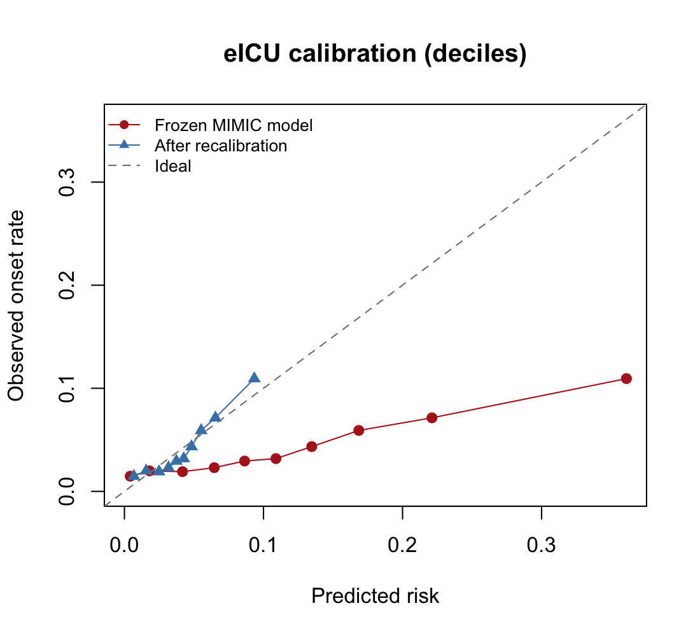

<!-- _class: lead -->

# Interpretable Statistical Modelling for Real-Time Sepsis-3 Onset Prediction in MIMIC-IV

### with External Validation on eICU-CRD

**Abdul Ahad**

M.Sc. in Computing
Department of Computer Science & Applied Physics
Atlantic Technological University (ATU), Galway

---

## The Clinical Problem

- Sepsis is life-threatening organ dysfunction from a dysregulated host response to infection (Sepsis-3 consensus).
- The Global Burden of Disease study attributed **≈11 million deaths** to sepsis in 2017, nearly **20% of all deaths worldwide**.
- Each additional hour before effective treatment is associated with **higher mortality**.

**Implication:** predicting the *onset* of sepsis a few hours ahead of clinical recognition can accelerate antibiotics, fluids, and source control, and thereby save lives.

---

## Two Modelling Traditions

| Machine learning | Classical statistics |
|---|---|
| Gradient-boosted trees, RNNs, transformers | Cox, logistic, GEE, trajectory models |
| High internal discrimination | Directly interpretable hazard / odds ratios |
| Assumptions rarely tested | Assumptions can be formally tested |
| Often a black box | Closed-form, portable coefficients |

This thesis argues that when the prediction ceiling is set by the labelling process rather than model complexity, **interpretability becomes a net gain, not a cost**.

---

## Three Research Gaps

- **G1 — Onset vs. prognosis.** MIMIC-IV statistical work overwhelmingly predicts mortality *after* diagnosis. Purely statistical real-time onset prediction has not been revisited since TREWScore (MIMIC-II, 2015).
- **G2 — Untested proportional hazards.** Sepsis hazards are frequently non-proportional, yet no reviewed MIMIC-IV Cox study reports testing the assumption.
- **G3 — Validation asymmetry.** External validation is common for prognostic nomograms but largely absent from onset prediction, where median AUROC falls from 0.886 (internal) to 0.783 (external).

---

## Research Question

> Can a **purely statistical** model, using routinely available real-time vitals and laboratory values in MIMIC-IV, predict impending Sepsis-3 onset **ahead of clinical recognition**, with performance comparable to or exceeding the rule-based scores SIRS, qSOFA, and SOFA?

**Sub-questions**
- **SQ1** — Strongest predictors of incident onset; does proportional hazards hold?
- **SQ2** — Do trajectories improve early detection over a static snapshot?
- **SQ3** — How does the model compare with SIRS/qSOFA/SOFA, and does it survive MIMIC-IV → eICU-CRD?

---

## Data and Cohort

**Development:** MIMIC-IV v3.1 — single-centre (Beth Israel Deaconess), >65,000 adult ICU stays.
**External:** eICU-CRD v2.0 — 200+ US ICUs, independently collected, different EHR systems.

**Inclusion (identical on both):** age ≥ 18, first ICU stay only, length of stay ≥ 4 h.

- MIMIC-IV cohort: **65,241 stays**
- Sepsis-3 prevalence (first-24h matrix): **37.1%**
- Exact hourly onset locatable for **32.0%** of stays (the temporal cohort)

---

## Methodological Commitments

- **Leakage safety** — only information a clinician would have at that hour: forward-filled values, time-since-last-measured counters, strict temporal conditioning.
- **Honest evaluation** — patient-grouped cross-validation (no patient in both train and test), plus frozen-model transport to a second database with no refitting.
- **Reproducibility** — numbered single-purpose stages, one configuration module, fixed random seed, all code released. Pipeline reporting follows the TRIPOD guidelines.

---

## System Architecture

Extract → Model → Evaluate. MIMIC-IV flows through cohort construction, hourly panel assembly, and onset labelling into seven statistical analyses; the frozen coefficients are then transported to eICU-CRD.

---

## Why Multivariable Modelling Is Needed

Septic stays show higher lactate, faster heart rates, and elevated respiratory rates, but with **substantial overlap**: no single feature cleanly separates the groups.

---

## The Landmark Design: Prevalent vs. Incident

- Spike at hour 0 = **prevalent** sepsis (present at admission, not predictable).
- Right tail = **incident** sepsis developing in the ICU — the correct target.
- Conditioning at the **hour-six landmark** yields **48,829 at-risk stays**; 6.8% develop onset within 12 h: a realistically imbalanced problem.

---

## Time to Onset by Inflammatory Status

Patients meeting ≥ 2 SIRS criteria at the landmark reach sepsis faster (14.2% vs. 7.8% by 24 h; log-rank p < 10⁻¹⁶). Even after accounting for the competing risk of death, SIRS raises onset incidence (subdistribution HR 1.49).

---

## SQ1 — Proportional Hazards Fails (C2)

Baseline Cox model at the hour-six landmark:

| Term | HR | 95% CI | p |
|---|---|---|---|
| Heart rate | 1.011 | [1.009, 1.013] | < 10⁻¹⁶ |
| Resp. rate | 1.021 | [1.019, 1.023] | < 10⁻¹⁶ |
| MAP | 0.988 | [0.986, 0.990] | < 10⁻¹⁶ |
| **SOFA total** | **0.762** | [0.748, 0.777] | < 10⁻¹⁶ |

- **SOFA is inversely associated** with incident onset: severity scores detect *established* dysfunction, not *impending* infection.
- Global Schoenfeld test **rejects** proportional hazards (p < 10⁻¹⁶) → a **time-varying Cox** model is fitted in response, locating the hazard in *current* heart rate.

---

## SQ3 — Bedside Scores Fail the Onset Task (C3)

Discrimination at the hour-six landmark (incident onset within 12 h):

| Model / Score | AUROC |
|---|---|
| SOFA at hour 6 | 0.359 (inverse) |
| qSOFA at hour 6 | 0.492 |
| SIRS at hour 6 | 0.586 |
| Multivariable logistic (static, 6 h) | 0.749 |
| Multivariable + 6 h trajectory slopes | 0.755 |
| **Full-feature elastic-net nomogram** | **0.775** |

No single clinical score is useful for incident onset. Adding trajectory slopes improves discrimination (DeLong p = 3.5 × 10⁻⁷), supporting **SQ2**.

---

## C4 — Informative Missingness

Ten largest coefficients are dominated by **"was this lab measured"** indicators:

| Feature | Odds ratio |
|---|---|
| **pf_ratio_msg** (was P/F measured) | **5.46** |
| creatinine_msg | 1.57 |
| hr_slope6_msg | 1.48 |
| sofa_total | 0.69 |

Ordering a P/F ratio multiplies the odds of onset **fivefold, independent of the result**. This quantifies a **label-recognition ceiling**: the onset label depends on clinician suspicion, and lab ordering reflects that same suspicion. It is a property of the data, not a model deficiency.

---

## C4 — The Clinical Nomogram

Each predictor contributes points; the total maps to a predicted risk. The "was-measured" indicators contribute substantial points, making the informative-missingness signal explicit and readable at the bedside.

---

## C1 — Dynamic Landmark Supermodel (central contribution)

- **One** elastic-net logistic model on **207,010** stacked landmark rows across landmarks {6, 12, 18, 24, 36, 48}, with `s`, `s²`, and 27 feature-by-`s` interactions.
- Pooled out-of-sample **AUROC = 0.797**.
- Matches bespoke per-landmark models while remaining a single deployable object that emits hourly-updating risk.

---

## Reading the Dynamic Pattern

- **Highest early** (AUROC 0.77 at hour 6): largest at-risk pool, strongest signal.
- **Dips mid-stay** (hours 18–24): incident onset is rarest and hardest to predict among survivors of the first hours.
- **Recovers late** (hours 36–48): a selected subpopulation in which remaining events carry a clearer signal.

The pattern matches the epidemiology of incident sepsis rather than reflecting model instability.

---

## Analysis 4 — Real-Time Alarm Burden

| Threshold | Sensitivity | False alarms / patient-day |
|---|---|---|
| 0.02 | 0.90 | 6.5 |
| 0.09 | 0.51 | 0.7 |

Catching 90% of cases costs ≈ 6.5 false alarms per patient-day (untenable fatigue). A calmer operating point (51% sensitivity, 0.7/day) is the number a deployment decision actually turns on.

---

## Analysis 6 — Trajectory Shape Predicts Onset

Three latent SOFA-trajectory classes over the first 24 h. The most-severe class carries an **18.8× odds** of incident Sepsis-3 (p = 1.5 × 10⁻⁷⁴) and a **5.0× hazard** of mortality. This extends prior trajectory work, which linked shape only to mortality.

---

## Analysis 7 — Confounder-Adjusted Causal Estimate

Effect of early (≤ 3 h) antibiotics on in-hospital mortality among 24,203 Sepsis-3 patients, across four estimators (crude, PSM, IPW, doubly-robust AIPW): all agree on **≈ 10% lower odds of death**. As observational work, unmeasured confounding cannot be ruled out.

---

## C5 — External Validation on eICU-CRD

| Metric | eICU | MIMIC |
|---|---|---|
| AUROC (frozen transport) | **0.686** | 0.775 |
| AUROC (internal eICU refit ceiling) | 0.711 | — |
| Calibration slope | 0.54 → recalibrated | 1.00 |

Frozen transport (0.686) sits close to the eICU refit ceiling (0.711): most of the drop reflects a harder multi-centre population, not model failure. A single-parameter recalibration fixes the miscalibration (Brier 0.052 → 0.040).

---

## Central Finding

The ceiling on incident-onset prediction is set by the **label's dependence on clinician recognition** (when cultures and antibiotics are ordered) rather than by model class.

- This is why the strongest predictors are missingness indicators.
- This is why a purely statistical model is competitive: no neural network is required to approach a ceiling imposed by the labelling process itself.

---

## Contributions

- **C1** — First interpretable statistical real-time Sepsis-3 onset model on MIMIC-IV; dynamic landmark supermodel, pooled AUROC 0.797.
- **C2** — Explicit proportional-hazards testing with a triggered time-varying reformulation.
- **C3** — Reframed benchmark: bedside scores fail on incident onset; nomogram reaches 0.775.
- **C4** — Informative-missingness characterisation and the label-recognition ceiling.
- **C5** — Reproducible, transportable pipeline externally validated on eICU-CRD.

---

## Threats to Validity

- The onset label partly reflects documentation timing, not the true biological transition.
- An assumed-zero SOFA baseline may slightly overcount dysfunction in chronic impairment.
- qSOFA uses MAP as a proxy for systolic blood pressure.
- Time-varying Cox and GBTM use sampled subsets for tractability.
- eICU validation adapts the suspected-infection trigger due to limited microbiology capture (~1.5% of stays).

These limits are documented rather than hidden.

---

## Conclusion and Future Work

**Conclusion.** A purely statistical, interpretable pipeline predicts incident Sepsis-3 onset, reframes the bedside-score benchmark, exposes an informative-missingness ceiling, and transports to a 200+ ICU external database.

**Future work.**
- Benchmark machine-learning models against this interpretable baseline on identical splits.
- Transport the supermodel across all landmark hours, not the hour-six landmark alone.
- Prospective, multi-centre evaluation of the recalibrated model at an acceptable alarm burden.

---

<!-- _class: lead -->

# Thanks

### Questions & Discussion

**Abdul Ahad**
M.Sc. in Computing · Atlantic Technological University (ATU), Galway

*All extraction, modelling, and evaluation code released for reproducibility.*
