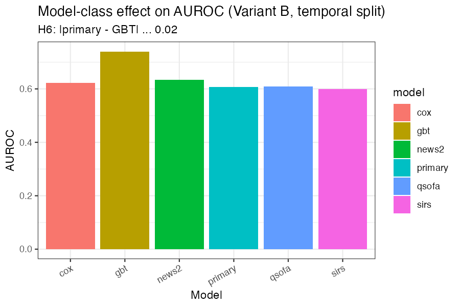

<!-- _class: lead -->

## Quantifying Model, Label, and Analyst Contributions to Variance in Real-Time Sepsis Onset Prediction

**Abdul Ahad**

M.Sc. in Computing
Department of Computer Science & Applied Physics
Atlantic Technological University (ATU), Galway

---

## WHAT — The Clinical Problem

- Sepsis: life-threatening organ dysfunction from a dysregulated host response to infection (Sepsis-3 consensus) [1].
- **11 million deaths** annually, ~20% of all deaths worldwide [2].
- Each additional hour before treatment is associated with **higher mortality** [3].
- An early warning system that detects impending sepsis *before* clinical recognition could save lives.

**91 published models** already exist for this task [4].

So why another study?

---

## The Hidden Decline in Clinical Utility

Wang et al. [4] reviewed 91 real-time sepsis prediction models and found:

| Metric               | Internal   | External   |
|----------------------|------------|------------|
| Median AUROC         | 0.811      | 0.783      |
| Median Utility Score | **+0.381** | **-0.164** |

- AUROC stays almost the same, so the model looks good.
- But the Utility Score becomes negative, meaning the model's alerts are causing more problems than benefits.
- AUROC shows prediction ability, but Utility Score [12] shows whether the model is actually useful in real clinical
  practice.

**The field has a failure it cannot see with its standard metrics.**

* AUROC (Area Under the Receiver Operating Characteristic Curve) measures how well a model can separate positive cases
  from negative cases.

---

## Limitations of the Conventional Approach

The traditional approach is:

Choose one Sepsis-3 definition → use one train/test split → report AUROC → compare models.

**Four key limitations:**

1. **The sepsis label can change.** Cohen et al. [5] showed that different ways of applying Sepsis-3 criteria to the
   same database can create very different patient groups (867–2,178 cases). The choice of label can affect results as
   much as the choice of model.

2. **The data split can give unrealistic results.** Guo et al. [6] found that sepsis prediction performance drops
   significantly when tested on data from a different time period. Random train/test splits may make models look better
   than they actually are.

3. **AUROC does not show the full picture.** Wang et al. [4] showed that a model can maintain a good AUROC while its
   clinical usefulness decreases. A high AUROC does not always mean the model helps doctors.

4. **The label may represent doctor decisions, not only patient deterioration.** Kamran et al. [7] suggested that
   models trained on clinical data may learn patterns of medical actions instead of learning the actual worsening of a
   patient's condition.

---

The traditional approach assumes that the model is the main factor affecting performance. Other things, such as the
sepsis label, data split, and evaluation method, are treated as minor technical choices.

**However, research shows that these choices can strongly affect the results:**

- The choice of sepsis label can change model performance as much as changing the model itself [5].
- The way data is divided into training and testing sets can decide whether the reported performance is realistic or
  misleading [6].
- The choice of evaluation metric can determine whether a model failure is detected or hidden [4].

> **Performance differences may come more from research decisions than from the AI model itself.**

This study measures how much performance variation comes from the model, the label, and the analyst's choices.
---

## Research Question

> In real-time sepsis prediction using MIMIC-IV [14], how much of the model's performance difference comes from:
>
> (a) the choice of AI model, and  
> (b) the researcher's decisions, including how sepsis is defined, how data is split, when prediction is made, and how
> performance is measured?

### Pre-Registered Hypotheses

| ID | Hypothesis                                                                             |
|----|----------------------------------------------------------------------------------------|
| H1 | Label choice affects AUROC as much as or more than model choice [5].                   |
| H2 | Feature importance changes across different label definitions [11].                    |
| H3 | Removing post-treatment information lowers AUROC by ≥0.03 [7].                         |
| H4 | Temporal testing gives lower AUROC than random testing by ≥0.02 [6].                   |
| H5 | Utility Score drops more than AUROC under realistic testing [4].                       |
| H6 | Statistical models perform close to gradient boosting models (within 0.02 AUROC) [13]. |

---

## Study Design

- **Development dataset:** MIMIC-IV v3.1 [14] (65,078 adult ICU stays)
- **External validation:** eICU-CRD v2.0 [15] (200+ US ICUs, 7.9 million person-hours)

**Three ways to define sepsis [1]:**

| Variant | Meaning      | When infection is confirmed                                                                 | SOFA baseline                              |
|---------|--------------|---------------------------------------------------------------------------------------------|--------------------------------------------|
| A       | **Strict**   | Antibiotics and blood culture must happen within **24 hours** of each other.                | SOFA score at ICU admission                |
| B       | **Standard** | Antibiotics can come up to **72 hours before** the blood culture, or **24 hours after** it. | SOFA score at ICU admission                |
| C       | **Broad**    | Antibiotics and blood culture can happen within **72 hours** of each other.                 | Lowest SOFA score in the previous 24 hours |

**In all three definitions, a patient has sepsis if:**

- There is **suspected infection**, and
- The **SOFA (Sequential Organ Failure Assessment) score increases by at least 2 points**.

---

## Validation Strategy

| Validation        | What was done                                                                      | Why?                                                                                              |
|-------------------|------------------------------------------------------------------------------------|---------------------------------------------------------------------------------------------------|
| **Internal**      | Trained on patients from **2008–2016** and tested on **2017–2019** data [6].       | To evaluate the model on newer, unseen patients.                                                  |
| **Pre-treatment** | Used only data collected **before the first antibiotic or blood culture** [7].     | To check whether the model is predicting sepsis or simply detecting when doctors start treatment. |
| **External**      | Tested the same trained model on the **eICU-CRD** [15] dataset without retraining. | To see whether the model works in other hospitals.                                                |

**Main evaluation metrics:** **Utility Score** [12] and **Calibration**.

**AUROC was reported only for comparison because it may not detect clinically important performance failures [4].**
---

## Primary Prediction Model

The main model is a **dynamic discrete-time competing-risks hazard model**.

- It predicts the **risk of sepsis every hour** during a patient's ICU stay.
- It is built using **multinomial pooled logistic regression**.
- D'Agostino et al. [8] showed that, under short time intervals, it gives results similar to a **time-dependent Cox
  regression**.
- Unlike the standard Cox model, it **does not require the proportional hazards assumption**.
- It also accounts for patients who **leave the ICU or die before developing sepsis** (competing risks).

**Models used for comparison:** Gradient-Boosted Trees (GBT), Static Cox model, NEWS2, qSOFA, and SIRS.

> [NOTES]

> **Multinomial pooled logistic regression:** A statistical model that predicts the probability of several possible
> outcomes at each time point.

> **Time-dependent Cox regression:** A Cox regression model that allows patient variables to change over time.

> **Proportional hazards assumption:** Assumes that the effect of each variable on risk stays constant over time.

> **Gradient-Boosted Trees (GBT):** A machine learning method that combines many small decision trees to make accurate
> predictions.

> **Static Cox model:** A Cox regression model that uses only the patient's initial information and assumes it does not
> change over time.

> **NEWS2:** National Early Warning Score 2, a clinical scoring system that detects patients at risk of serious
> deterioration.

> **qSOFA:** Quick Sequential Organ Failure Assessment, a simple three-factor score used to identify patients at high
> risk of sepsis.

> **SIRS:** Systemic Inflammatory Response Syndrome, a set of clinical criteria used to detect widespread inflammation
> that may indicate infection.
---

## Methodological Commitments

- **Pre-registered protocol:** The study plan was fixed before model development to reduce bias (following TRIPOD+AI
  guidelines [9]).

- **Leakage prevention:** The model only uses information available at each prediction time; missing values are handled
  using past information only.

- **Patient-level separation:** The same patient never appears in both training and testing data.

- **Frozen external validation:** The model trained on MIMIC-IV is directly tested on eICU-CRD without retraining.

- **Reproducible pipeline:** The complete workflow uses organised scripts, shared configurations, and publicly available
  code for replication.

> **TRIPOD+AI guidelines:** A reporting standard that helps researchers develop and clearly report reliable AI
> prediction models.

---

## Results : Cohort and Label Variance

| Variant | Name             | ICU Stays | Sepsis Cases | Percentage |
|---------|------------------|-----------|--------------|------------|
| A       | Narrow           | 65,078    | 6,252        | 9.6%       |
| B       | Seymour-Standard | 65,078    | 6,447        | 9.9%       |
| C       | Liberal          | 65,078    | **12,581**   | **19.3%**  |

The Liberal definition found almost **2 times more sepsis cases** than the other two definitions.

The patient data and database were the same. Only the way sepsis was defined was different.

> Narrow: Strict rules → fewer patients are labeled as sepsis.

> Seymour-Standard: Common/standard Sepsis-3 interpretation.

> Liberal: More flexible rules → more patients are labeled as sepsis.
---

## Results : Internal Performance (Temporal Test)

| Variant | Model   | AUROC     | Utility Score | Alert Burden |
|---------|---------|-----------|---------------|--------------|
| A       | Primary | 0.760     | **-1.000**    | ∞            |
| A       | GBT     | 0.747     | -4.819        | 204          |
| B       | Primary | 0.607     | -1.004        | ∞            |
| B       | **GBT** | **0.740** | -5.112        | 207          |
| C       | Primary | 0.759     | -1.000        | ∞            |
| C       | GBT     | 0.754     | -2.458        | 91           |
| —       | NEWS2   | 0.63–0.64 | -1.1 to -1.6  | 97–221       |

**Main finding:**

All models had a **negative Utility Score**, meaning they did not provide clinical benefit and performed worse than
giving no alerts.

Although AUROC values look reasonable, the models produced too many false alarms.

**Alert burden:** For every real sepsis alert, the system generated **91–340 false alerts** (benchmark: 1.4 false alerts
per true alert [10]).

### Notes

> **AUROC:** Measures how well a model can separate patients with sepsis from patients without sepsis. Higher values
> mean better ranking ability.

> **Utility Score:** Measures whether the model provides real clinical benefit. A negative score means the model is not
> useful in practice.

> **Alert Burden:** Shows how many false alerts are generated for each correct alert. Lower is better.

> **Primary Model:** The main proposed model developed in this study.

> **GBT (Gradient-Boosted Trees):** A machine learning model that combines many decision trees to improve prediction
> accuracy.

> **NEWS2 (National Early Warning Score 2):** A standard clinical scoring system used by healthcare professionals to
> detect patient deterioration.
---

## Results : H1: Label Has More Impact Than Model (CONFIRMED)

- **Label variation:** AUROC changed by **0.153** when the sepsis definition changed while using the same model.
- **Model variation:** AUROC changed by **0.140** when the model changed while using the same label.
- The effect of choosing a different label was slightly larger than choosing a different model.
- This confirms Cohen et al.'s [5] finding that sepsis label definition can strongly influence model performance, now
  demonstrated on a larger MIMIC-IV dataset.

**Conclusion:** The way sepsis is defined can affect performance as much as, or more than, the AI model itself.

## Results : H2: Coefficient Instability (CONFIRMED)

- **10 out of 25 features** changed their effect or strength significantly across different sepsis label definitions.
- Affected features include: MAP (**Mean Arterial Pressure**), temperature, bilirubin, platelets, vasopressors,
  norepinephrine/epinephrine, respiratory rate change, platelet measurement, WBC measurement, and P/F ratio.

**Implication:** A published hazard ratio for MAP (**Mean Arterial Pressure**) could show a positive, negative, or
almost no association with sepsis risk depending only on how the antibiotic-culture time window is defined [11].

Feature effects cannot be reliably interpreted without knowing which sepsis label definition was used.

## Notes

> **Hazard Ratio:** Shows how a feature changes the risk of an event happening over time. A value above 1 means higher
> risk, below 1 means lower risk, and around 1 means little effect.
---

## Results : H3: Treatment Leakage and Label Construction

The treatment-anchored window [7] uses only information available **before the first antibiotic or blood culture**.

- **179,003 patient-hours** were analysed.
- **0 sepsis onset events** were found in this period.

No sepsis onset event is found before the clinical actions used to define the Sepsis-3 label.

This is not just a small drop in model performance (0.03 AUROC). The prediction target is completely missing in the
clinically realistic time window.

**Most MIMIC-IV sepsis prediction models are learning when doctors suspect sepsis and start treatment, rather than
detecting when a patient's health is starting to get worse.**

---

## Results : H6: Model-Class Difference (REJECTED)

- **GBT AUROC:** 0.740
- **Primary Model AUROC:** 0.607
- Difference: **0.133** (larger than the 0.02 threshold)

GBT looks better based on AUROC.

However:

- **GBT Utility Score:** -5.112
- **Primary Model Utility Score:** -1.004

The GBT model has better AUROC but worse clinical usefulness.

This shows that the model ranking changes depending on the evaluation metric. A model that looks better by AUROC may
perform worse in real clinical use.

---

## Results — External Validation on eICU-CRD [15]

| Variant | Model   | AUROC (eICU) | AUROC (MIMIC) | Drop      |
|---------|---------|--------------|---------------|-----------|
| A       | Primary | 0.736        | 0.760         | 0.023     |
| B       | Primary | **0.437**    | 0.607         | **0.170** |
| C       | Primary | 0.725        | 0.759         | 0.034     |
| —       | NEWS2   | 0.605        | 0.63          | 0.023     |

- Variants A and C showed similar performance on both datasets, with only small drops.
- **Variant B (Seymour-Standard) showed a large performance drop of 0.170 AUROC when tested on eICU-CRD.**
- The most commonly used sepsis label definition did not transfer well to a different hospital dataset.

---

## Results — Performance Variation by Source

| Factor                                     | AUROC Change | Related Hypothesis |
|--------------------------------------------|--------------|--------------------|
| Model choice                               | 0.140        | H6                 |
| Sepsis label definition                    | 0.153        | H1                 |
| Evaluation metric (AUROC vs Utility Score) | 0.170        | H5                 |

Different choices create large changes in reported performance.

The choice of **model** and the choice of **sepsis label definition** have a similar impact on results. Changing only
one while keeping the other fixed can significantly change the evaluation.

Most studies fix one sepsis label and compare models. This measures only one source of variation while ignoring another
source of similar importance.

---

## Results — Equity Analysis (Novel Finding)

The percentage of patients labelled as septic changed by **8.7–12.8 percentage points** across different label
definitions within racial subgroups.

- The **Unknown/Unable-to-obtain** groups showed the largest changes (12.3–12.8 percentage points).
- This is the first study to examine both:
    - differences in model performance between patient groups, and
    - differences in how often patient groups are labelled as septic due to label choice [13].

The patients identified as septic can change depending on how the label is defined. This creates a potential fairness
issue because the label itself may affect different groups differently.

---

## Key Finding

The performance collapse reported by Wang et al. [4] is not only a model evaluation issue. This study shows that it is
strongly related to how the sepsis label is constructed.

The Sepsis-3 label in MIMIC-IV has three important limitations:

1. **Depends on clinical actions** — No sepsis cases are identified before treatment starts [7].
2. **Sensitive to label definition** — Different reasonable interpretations can produce almost double the number of
   sepsis cases [5].
3. **Produces poor clinical utility** — All tested models show negative Utility Scores [4].

These findings suggest that improving model complexity alone cannot solve the problem. Better sepsis label design is
required.

---

## Contributions

| #  | Contribution                                                                                                                        |
|----|-------------------------------------------------------------------------------------------------------------------------------------|
| C1 | Compared three different Sepsis-3 label definitions using the same prediction model on MIMIC-IV [5].                                |
| C2 | Showed that no sepsis cases exist before antibiotics or culture tests, highlighting that the label depends on clinical actions [7]. |
| C3 | Confirmed that all models had negative Utility Scores, extending the findings of Wang et al. [4].                                   |
| C4 | Found that 10 clinical features changed their effects across different label definitions, supporting Lauritsen et al. [11].         |
| C5 | First study to examine how different sepsis label definitions affect racial subgroup analysis [13].                                 |
| C6 | Used a pre-registered, TRIPOD+AI-compliant, fully reproducible research pipeline [9].                                               |

---

## Limitations

- **Small external event count:** The eICU dataset had only **63 sepsis cases**, making some evaluation metrics less
  reliable.
- **H4 was not fully tested:** The planned random-split comparison was not included in the main analysis.
- **Deep learning comparison:** A deep survival model was planned but not implemented.
- **Limited features:** Clinical notes, procedure codes, and ventilator settings were not included.
- **Specific to Sepsis-3:** These findings apply to the Sepsis-3 label and may not apply to other sepsis definitions.

These limits are documented rather than hidden.

---

## Future Work

1. **Better sepsis labels:** Define sepsis using objective patient measurements (such as lactate levels and organ
   function) instead of treatment decisions.
2. **Prospective study:** Test the new label in real clinical settings using future patient data.
3. **Better alert threshold:** Choose the alert threshold that maximises clinical benefit (Utility Score) instead of
   only improving prediction accuracy.
4. **Multi-hospital evaluation:** Test the model in different hospitals and identify an acceptable number of false
   alerts for clinical use.

---

<!-- _class: refs -->

## References (1/2)

[1] M. Singer, C. S. Deutschman, C. W. Seymour et al., "The Third International Consensus Definitions for Sepsis and
Septic Shock (Sepsis-3)," *JAMA*, vol. 315, no. 8, pp. 801–810, 2016.

[2] K. E. Rudd, S. C. Johnson, K. M. Agesa et al., "Global, regional, and national sepsis incidence and mortality,
1990–2017: Analysis for the Global Burden of Disease Study 2017," *The Lancet*, vol. 395, no. 10219, pp. 200–211, 2020.

[3] C. W. Seymour, F. Gesten, H. C. Prescott et al., "Time to treatment and mortality during mandated emergency care for
sepsis," *New England Journal of Medicine*, vol. 376, no. 23, pp. 2235–2244, 2017.

[4] Z. Wang, W. Wang, C. Sun et al., "A methodological systematic review of validation and performance of sepsis
real-time prediction models," *npj Digital Medicine*, vol. 8, no. 1, p. 190, 2025.

[5] S. N. Cohen, J. Foster, P. Foster et al., "Subtle variation in Sepsis-III definitions markedly influences predictive
performance within and across methods," *Scientific Reports*, vol. 14, no. 1, p. 1920, 2024.

[6] L. L. Guo, S. R. Pfohl, J. Fries et al., "Evaluation of domain generalization and adaptation on improving model
robustness to temporal dataset shift in clinical medicine," *Scientific Reports*, vol. 12, no. 1, p. 2726, 2022.

[7] F. Kamran, D. Tjandra, A. Heiler et al., "Evaluation of sepsis prediction models before onset of treatment," *NEJM
AI*, vol. 1, no. 3, 2024.

[8] R. B. D'Agostino, M.-L. Lee, A. J. Belanger et al., "Relation of pooled logistic regression to time dependent Cox
regression analysis: The Framingham Heart Study," *Statistics in Medicine*, vol. 9, no. 12, pp. 1501–1515, 1990.

---

<!-- _class: refs -->

## References (2/2)

[9] G. S. Collins, K. G. M. Moons, P. Dhiman et al., "TRIPOD+AI statement: Updated guidance for reporting clinical
prediction models that use regression or machine learning methods," *BMJ*, vol. 385, e078378, 2024.

[10] M. Moor, N. Bennett, D. Plečko et al., "Predicting sepsis using deep learning across international sites: A
retrospective development and validation study," *eClinicalMedicine*, vol. 62, 102124, 2023.

[11] S. M. Lauritsen, B. Thiesson, M. J. Jørgensen et al., "The framing of machine learning risk prediction models
illustrated by evaluation of sepsis in general wards," *npj Digital Medicine*, vol. 4, no. 1, p. 158, 2021.

[12] M. A. Reyna, C. S. Josef, R. Jeter et al., "Early prediction of sepsis from clinical data: The PhysioNet/Computing
in Cardiology Challenge 2019," *Critical Care Medicine*, vol. 48, no. 2, pp. 210–217, 2020.

[13] H. Wang, Y. Li, A. Naidech, and Y. Luo, "Comparison between machine learning methods for mortality prediction for
sepsis patients with different social determinants," *BMC Medical Informatics and Decision Making*, vol. 22, Suppl 2, p.
156, 2022.

[14] A. Johnson, L. Bulgarelli, L. Shen et al., "MIMIC-IV, version 3.1," PhysioNet, 2023. doi: 10.13026/6mm1-ek67.

[15] T. J. Pollard, A. E. W. Johnson, J. D. Raffa et al., "The eICU Collaborative Research Database, a freely available
multi-centre database for critical care research," *Scientific Data*, vol. 5, 180178, 2018.

---

<!-- _class: lead -->

# Thank You

### Questions & Discussion

**Abdul Ahad**
M.Sc. in Computing · Atlantic Technological University (ATU), Galway

*Pre-registered protocol. All extraction, modelling, and evaluation code released for reproducibility.*
